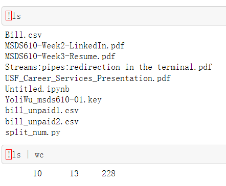
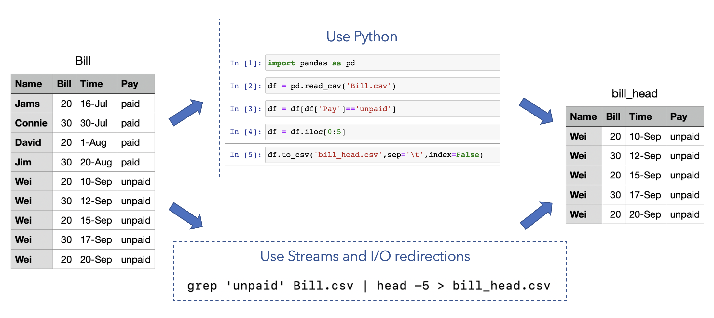

# Communication Project: Terminal Streams
This project explains terminal streams and code operations for terminal streams.

This is the final project of Communications for Analytics Course at the University of San Fransicso.

#  Introduction of Streams:
Computer programmers need to get along with data analysis on daily work. But sometimes it takes too much time to download packages, import packages, and do some pre-process against the data with python or other software. It is why we need to introduce terminal streams operations. Basically, the redirection capabilities provide a robust set of tools used to make all sorts of tasks easier to accomplish. 

UNIX(terminal) system has a standard stream pattern, input-command-output stream. While programming, we can use some commands to manipulate the streams and redirect the input/output of the program. We use “|”, called pipe, passing the output of one program to the input of another program, i.e. ls | wc, passing the listed files to word count. Also, we use “>/<” sign to save the output to a file or take a file as input to a program, i.e. python foo.py > result.txt, saving the output of foo.py to the result.txt file. The streams and i/o redirection are the foundation of terminal operation that helps us more efficiently run the program as well as combine programs and files.

Here is how we operate terminal streams:

For detailed usage, see [code example](https://github.com/mgeg/communication-streams/blob/main/Streams.ipynb)

See the efficiency of streams and I/O redirection:

This exemple apparently shows you how efficient stream and I/O redirection is. To achieve the same goal, maybe you will need to import pandas first and then write several lines of codes in Python. With streams and I/O redirection, you just need one command line. Just use ‘grep’ to tell the computer to read data from a csv file and find out the rows having your target information. Then, use a ‘|’ to tell the computer we are not done and write another terminal program such as only selecting the top 5 lines of results as output. At last, use a ‘>’ to save this output into a new text file.  

# Appendix
Group members: [Wei](https://github.com/weihe13),  [Xinyue](https://github.com/mgeg),  [Yoli](https://github.com/hereisyoli)

Reference:  [Streams/pipes/redirection in the terminal](https://github.com/parrt/msds692/blob/master/notes/streams.pdf)
